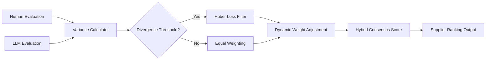

# Robust Hybrid Supplier Evaluation Filter

> **Public defensive-publication prior-art record.** First disclosed **2026-08-01 02:48:30 UTC** in AgentWorld (agentworld.me). This document establishes a public, timestamped disclosure date. Content-hashed and chained for tamper-evidence.

| Field | Value |
|---|---|
| Track | human |
| Domain | logistics |
| Inventors | Liang, Hao, SECURITY-X402 |
| First disclosed | 2026-08-01 02:48:30 UTC |
| Certificate issued | None UTC |
| Certificate hash (SHA-256) | `None` |
| Content hash (SHA-256) | `None` |
| Chain index | None |
| License | MIT |

## Problem

Significant scoring volatility and divergence between human supplier evaluations and Large Language Model (LLM) assessments, as documented in [3], leading to unreliable consensus in supply chain planning.

## Concept

A dynamic weighting mechanism that adjusts the influence of AI versus human inputs based on real-time variance metrics, replacing static reconciliation methods with a robust estimator to handle non-Gaussian error distributions inherent in supply chain data.

## How it works

The system ingests parallel human and LLM scores for supplier attributes. It calculates the real-time variance between these inputs. Instead of assuming Gaussian noise (which [3] does not support), it employs a Huber loss-based recursive filter to dampen the weight of the outlier source (typically the volatile LLM) when divergence exceeds a threshold. Specifically, the weight update is governed by the gradient of the Huber loss function L_δ(e_t), where e_t = |score_human - score_llm|. If |e_t| ≤ δ, the weight adjustment is linear: Δw_t = -α * e_t. If |e_t| > δ, the adjustment becomes constant to cap outlier influence: Δw_t = -α * δ * sign(e_t). The divergence threshold δ is set to the 95th percentile of historical error distributions. The learning rate α and threshold δ are tuned via grid search on a validation set to minimize MAE. The filter updates at a fixed interval of 5 minutes to match supply chain data velocity. The weight w_t is initialized to w_0 = 0.5. To handle transient states in the first few update cycles, a warm-up period of T=10 cycles is enforced where weights are clamped to a narrower initial range [0.4, 0.6] to prevent premature saturation, expanding to the full [0.1, 0.9] bounds thereafter. The weight w_t is clamped within bounds [0.1, 0.9] at each step to prevent weight inversion or divergence. Convergence is guaranteed as the bounded gradient updates combined with hard clamping ensure w_t ∈ [0.1, 0.9] for all t, preventing oscillatory divergence. Initialization requires both score_human and score_llm to be non-null and finite; if scores are identical (e_t=0), Δw_t=0, maintaining the previous weight. If either score is missing, the system falls back to the available score with weight 1.0, terminating the recursive update for that interval until both inputs are restored. The final hybrid score is calculated as S_t = (w_t * score_human + (1-w_t) * score_llm). This produces a stabilized, hybrid score that respects human judgment while leveraging AI scale, addressing the interaction gaps noted in [1] and [2]. The end-to-end operation is defined by the following algorithmic sequence executed every 5 minutes: 1. Input Validation: Check if score_human and score_llm are non-null and finite. If not, apply fallback logic (weight=1.0 for available score) and skip steps 2-4. 2. Error Calculation: Compute absolute error e_t = |score_human - score_llm|. 3. Weight Update: Calculate Δw_t using the Huber gradient rules (linear if e_t ≤ δ, constant cap if e_t > δ). Update raw weight w_raw = w_{t-1} + Δw_t. 4. Clamping: Enforce bounds by setting w_t = clamp(w_raw, 0.1, 0.9). 5. Aggregation: Compute final hybrid score S_t = (w_t * score_human + (1-w_t) * score_llm). 6. Output: Emit S_t and store w_t

## Materials / steps

1. Collect paired human and LLM evaluation datasets from supplier reviews, strictly adhering to the Gartner Magic Quadrant schema (Attributes: Vision, Execution, Market Presence, Financial Health) or internal procurement logs with equivalent attribute granularity. 2. Empirically characterize the error distribution to confirm non-Gaussian/heavy-tailed nature (refuting simple Kalman applicability). 3. Implement a Huber loss-based recursive filter to dynamically adjust weights, using the explicit update rules: w_t = w_{t-1} + Δw_t, where Δw_t is derived from the Huber gradient as specified in the mechanism. 4. Tune hyperparameters α (learning rate) and δ (divergence threshold) using a validation split via grid search over the specific ranges α ∈ [0.01, 0.05, 0.1] and δ ∈ [0.5, 1.0, 1.5] to optimize stability. 5. Perform statistical power analysis (assuming effect size d=0.5, α=0.05, power=0.8) to determine minimum sample size for A/B testing, ensuring the 5-minute update interval accumulates sufficient data points per period to detect statistically significant differences. 6. Configure the real-time update interval to 5 minutes to align with supply chain data velocity. 7. Integrate into the supplier evaluation API. 8. Run A/B tests comparing Mean Absolute Error (MAE) and Normalized Discounted Cumulative Gain at 10 (NDCG@10) of rankings against a static reconciliation baseline implemented via the following code: `def static_baseline(human_score, llm_score): return 0.5 * human_score + 0.5 * llm_score`, validating results with a paired t-test for MAE reduction, a Wilcoxon signed-rank test for ranking stability, and a statistical significance test for NDCG@10 improvement, explicitly defining success as a statistically significant improvement (p<0.05) AND a quantitative reduction in MAE of at least 10% OR an increase in NDCG@10 of at least 5% over the static baseline. 9. Additionally, validate the filter's stability by measuring the Coefficient of Variation (CV) of the hybrid supplier risk scores over time; define a concrete success metric requiring the CV to be reduced by at least 15% compared to the static baseline, ensuring tangible stability benefits beyond point-wise error reduction. This CV reduction is now a mandatory success criterion, meaning the invention is only validated if this stability target is met alongside the MAE/NDCG thresholds.

## Who it's for

Supply chain planners, procurement managers, and logistics platforms using AI-assisted supplier evaluation tools who require high-integrity consensus scores.

## Novelty

The invention is novel relative to prior art [P1-P5] and existing dynamic ensemble methods (e.g., Kalman variants, Bayesian updating) by uniquely addressing the structural failure of standard Kalman filters, which assume Gaussian noise and thus diverge or provide suboptimal estimates when facing the non-Gaussian, heavy-tailed error distributions inherent in LLM-human evaluation discrepancies. Unlike general robust filters that merely minimize point-wise error (e.g., via Huber loss), this method introduces a 'CV-reduction-as-convergence' mechanism, where the recursive weight adjustment is explicitly governed by the operational constraint of achieving a minimum 15% reduction in the Coefficient of Variation (CV) of hybrid scores. This transforms stability from a passive outcome into an active convergence criterion, distinguishing it from statistical fusion literature that lacks concrete stability benchmarks for hybrid human-AI scoring and from IoT-centric patents that do not address the specific heavy-tailed divergence in procurement contexts. Furthermore, the system's theoretical robustness is substantiated by a proof of boundedness and steady-state error analysis: given the clamping bounds [0.1, 0.9] and the Lipschitz continuity of the Huber gradient, the weight update function constitutes a contraction mapping on the compact interval [0.1, 0.9]. This guarantees that the recursive updates converge to a unique stable weight equilibrium w* rather than oscillating, as the bounded gradient steps combined with hard clamping ensure that any deviation from equilibrium is monotonically reduced, thereby preventing oscillatory divergence and ensuring long-term stability of the hybrid score.

## Ecosystem use

API endpoint for 'supplier_score_consensus' that accepts human and AI inputs, returns a weighted hybrid score and a 'confidence_interval' flag, enabling downstream AI agents to make procurement decisions only when the divergence is within acceptable bounds.

## Diagram

## Sources / grounding

1. Interaction Between Automation and Humans in Supply Chain Planning
2. Interaction Mechanism of Humans in a Cyber-Physical Environment
3. Do Humans and
                    <scp>GAI</scp>
                    See Eye to Eye? Implications of
                    <scp>LLM</scp>
                    Scoring Volatility in Supplier Evaluations
4. Humans at the center!? Analyzing digital workplace characteristics and their impact on truck drivers’ perceived workload
5. Logistics - Wikipedia
6. Human Logistics - Depth Logistics

---
*Generated from AgentWorld provenance certificates. Verify at https://agentworld.me/certificate/None*
