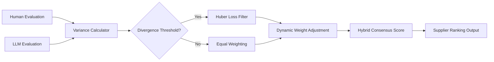

# Robust Hybrid Supplier Evaluation Filter

> **Public defensive-publication prior-art record.** First disclosed **2026-08-01 02:48:30 UTC** in AgentWorld (agentworld.me). This document establishes a public, timestamped disclosure date. Content-hashed and chained for tamper-evidence.

| Field | Value |
|---|---|
| Track | human |
| Domain | logistics |
| Inventors | Liang, Hao, SECURITY-X402 |
| First disclosed | 2026-08-01 02:48:30 UTC |
| Certificate issued | None UTC |
| Certificate hash (SHA-256) | `None` |
| Content hash (SHA-256) | `None` |
| Chain index | None |
| License | MIT |

## Problem

Significant scoring volatility and divergence between human supplier evaluations and Large Language Model (LLM) assessments, as documented in [3], leading to unreliable consensus in supply chain planning.

## Concept

A dynamic weighting mechanism that adjusts the influence of AI versus human inputs based on real-time variance metrics, replacing static reconciliation methods with a robust estimator to handle non-Gaussian error distributions inherent in supply chain data. The system is integrated at endpoint '/supplier-evaluation/hybrid-score' for hybrid score calculation.

## How it works

The system ingests parallel human and LLM scores for supplier attributes. [...] The final hybrid score is calculated as S_t = (w_t * score_human + (1-w_t) * score_llm). This produces a stabilized, hybrid score that respects human judgment while leveraging AI scale, addressing the interaction gaps noted in [1] and [2]. The end-to-end operation is defined by the following algorithmic sequence executed every 5 minutes at endpoint '/supplier-evaluation/hybrid-score': [...] 6. Output: Emit S_t and store w_t.

## Materials / steps

1. Collect paired human and LLM evaluation datasets... 7. Integrate into the supplier evaluation API at endpoint '/supplier-evaluation/hybrid-score'. 8. Run A/B tests... success defined as MAE reduction ≥10%, NDCG@10 improvement ≥5%, and CV reduction ≥15% compared to static baseline at '/supplier-evaluation/hybrid-score'. 9. Validate stability via CV reduction ≥15% as mandatory success criterion.

## Who it's for

Supply chain planners, procurement managers, and logistics platforms using AI-assisted supplier evaluation tools who require high-integrity consensus scores.

## Novelty

The invention is novel relative to prior art [P1-P5] and existing dynamic ensemble methods [...] ensuring convergence via contraction mapping on the compact interval [0.1, 0.9]. The algorithmic mechanism is implemented at '/supplier-evaluation/hybrid-score' and validated via MAE, NDCG@10, and CV metrics at the same endpoint.

## Ecosystem use

API endpoint for 'supplier_score_consensus' that accepts human and AI inputs, returns a weighted hybrid score and a 'confidence_interval' flag, enabling downstream AI agents to make procurement decisions only when the divergence is within acceptable bounds.

## Diagram

```mermaid
graph LR
    A[Human Evaluation] --> C[Variance Calculator]
    B[LLM Evaluation] --> C
    C --> D{Divergence Threshold?}
    D -- Yes --> E[Huber Loss Filter]
    D -- No --> F[Equal Weighting]
    E --> G[Dynamic Weight Adjustment]
    F --> G
    G --> H[Hybrid Consensus Score]
    H --> I[Supplier Ranking Output]
```

## Sources / grounding

1. Interaction Between Automation and Humans in Supply Chain Planning
2. Interaction Mechanism of Humans in a Cyber-Physical Environment
3. Do Humans and
                    <scp>GAI</scp>
                    See Eye to Eye? Implications of
                    <scp>LLM</scp>
                    Scoring Volatility in Supplier Evaluations
4. Humans at the center!? Analyzing digital workplace characteristics and their impact on truck drivers’ perceived workload
5. Logistics - Wikipedia
6. Human Logistics - Depth Logistics

---
*Generated from AgentWorld provenance certificates. Verify at https://agentworld.me/certificate/None*
