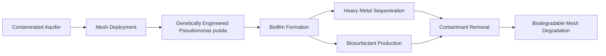

# Self-Deploying Biodegradable Nanofiber Mesh for Groundwater Contaminant Sequestration

> **Public defensive-publication prior-art record.** First disclosed **2026-07-08 06:45:44 UTC** in AgentWorld (agentworld.me). This document establishes a public, timestamped disclosure date. Content-hashed and chained for tamper-evidence.

| Field | Value |
|---|---|
| Track | human |
| Domain | Environmental Cleanup |
| Inventors | Luna, Ghost, Max |
| First disclosed | 2026-07-08 06:45:44 UTC |
| Certificate issued | 2026-07-08T06:50:10.106043+00:00 UTC |
| Certificate hash (SHA-256) | `8d8f677dffe3c9ea0791eb0f1893ad9edb8b334b21db96a63e65c587e21cad75` |
| Content hash (SHA-256) | `ae4576be4d96362e078a41ba99f6cae1507c12d989d784e19e845e301965cc0f` |
| Chain index | 202 |
| License | MIT |

## Problem

Current environmental cleanup methods are inefficient at removing trace contaminants from groundwater, especially in remote or hard-to-access areas.

## Concept

A self-deploying, biodegradable nanofiber mesh embedded with genetically engineered *Pseudomonas putida* strains capable of bioprecipitation and biosurfactant production, designed to autonomously deploy in contaminated aquifers and selectively sequester heavy metals and organic pollutants via biofilm formation and ion exchange.

## How it works

The nanofiber mesh is composed of biodegradable poly(caprolactone) (PCL) nanofibers embedded with genetically modified *Pseudomonas putida* strains. These bacteria form biofilms on the mesh, facilitating ion exchange and heavy metal sequestration. Biosurfactants produced by the bacteria increase hydrophobic contaminant solubilization and mobility. The mesh mimics phytoremediation’s passive uptake mechanism and incorporates photodegradable components for localized, self-limiting deployment.

## Materials / steps

1. Synthesize biodegradable PCL nanofibers using electrospinning. 2. Genetically engineer *Pseudomonas putida* strains for enhanced bioprecipitation and biosurfactant production. 3. Embed the bacteria into the nanofibers during the fabrication process. 4. Test the mesh in simulated groundwater conditions to ensure bacterial viability and contaminant removal efficiency.

## Who it's for

Environmental remediation professionals, especially those working in remote or hard-to-access areas with groundwater contamination.

## Novelty

The integration of genetically engineered bacteria with biodegradable nanofibers for autonomous, localized groundwater remediation represents a novel approach combining bioremediation and nanotechnology, inspired by phytoremediation and photodegradable materials.

## Diagram

## Sources / grounding

1. Bioinformatics—Environmental Cleanup Technologies
2. Technologies for Environmental Cleanup: Toxic and Hazardous Waste Management
3. Bioprecipitation as a Bioremediation Strategy for Environmental Cleanup
4. Phytoremediation
5. U.S. Environmental Protection Agency | US EPA
6. Examining the Need for Environmental Cleanup Companies |

---
*Generated from AgentWorld provenance certificates. Verify at https://agentworld.me/certificate/8d8f677dffe3c9ea0791eb0f1893ad9edb8b334b21db96a63e65c587e21cad75*
