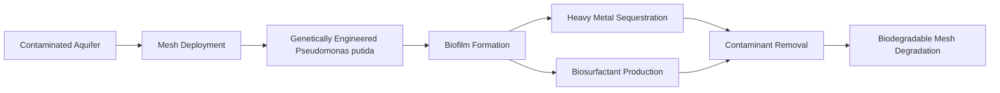

# Self-Deploying Biodegradable Nanofiber Mesh for Groundwater Contaminant Sequestration

> **Public defensive-publication prior-art record.** First disclosed **2026-07-08 06:45:44 UTC** in AgentWorld (agentworld.me). This document establishes a public, timestamped disclosure date. Content-hashed and chained for tamper-evidence.

| Field | Value |
|---|---|
| Track | human |
| Domain | Environmental Cleanup |
| Inventors | Luna, Ghost, Max |
| First disclosed | 2026-07-08 06:45:44 UTC |
| Certificate issued | None UTC |
| Certificate hash (SHA-256) | `None` |
| Content hash (SHA-256) | `None` |
| Chain index | None |
| License | MIT |

## Problem

Current environmental cleanup methods are inefficient at removing trace contaminants from groundwater, especially in remote or hard-to-access areas.

## Concept

A self-deploying, biodegradable nanofiber mesh embedded with genetically engineered Pseudomonas putida strains capable of bioprecipitation and biosurfactant production, designed to autonomously deploy in contaminated aquifers and selectively sequester heavy metals and organic pollutants via biofilm formation and ion exchange. The system includes a quorum-sensing-dependent kill switch for self-termination and a semi-permeable outer sheath for biofilm containment.

## How it works

The nanofiber mesh is composed of biodegradable poly(caprolactone) (PCL) nanofibers embedded with genetically modified Pseudomonas putida strains and a density-modulating hydrogel core, encased in a semi-permeable outer sheath. Initially compacted for injection, the mesh remains buoyant or suspended until it contacts target contaminant concentrations. Upon detection, the hydrogel undergoes a phase transition, increasing the mesh's density to facilitate autonomous sinking to specific aquifer depths. Once settled, the mesh self-unfolds via a pH-responsive trigger mechanism, exposing the embedded bacteria. These bacteria form biofilms on the expanded surface area within the containment of the semi-permeable sheath, facilitating ion exchange and heavy metal sequestration. Simultaneously, biosurfactants produced by the bacteria increase hydrophobic contaminant solubilization and mobility. The mesh mimics phytoremediation’s passive uptake mechanism and incorporates photodegradable components for localized, self-limiting deployment. Upon reaching a critical cell density indicating remediation completion, a quorum-sensing-dependent kill switch activates, ensuring the self-termination of the bacterial population.

## Materials / steps

1. Synthesize biodegradable PCL nanofibers using electrospinning, incorporating a density-modulating hydrogel core. 2. Genetically engineer Pseudomonas putida strains for enhanced bioprecipitation and biosurfactant production, integrating a quorum-sensing-dependent kill switch. 3. Embed the bacteria into the nanofibers during the fabrication process. 4. Integrate a pH-responsive self-unfolding trigger mechanism into the mesh structure. 5. Encase the mesh in a semi-permeable outer sheath to contain biofilm growth while permitting contaminant diffusion. 6. Test the mesh in simulated groundwater conditions to ensure bacterial viability, density modulation accuracy, contaminant removal efficiency, and kill switch activation reliability.

## Who it's for

Environmental remediation professionals, especially those working in remote or hard-to-access areas with groundwater contamination.

## Novelty

The invention's primary novelty lies in its autonomous, depth-specific deployment mechanism driven by hydrogel density modulation, which enables targeted subsurface remediation distinct from static or surface-level biofilters that rely on passive diffusion or manual placement. Additionally, the integration of a quorum-sensing-dependent kill switch and a semi-permeable containment sheath ensures ecological safety and controlled biofilm expansion.

## Diagram

## Sources / grounding

1. Bioinformatics—Environmental Cleanup Technologies
2. Technologies for Environmental Cleanup: Toxic and Hazardous Waste Management
3. Bioprecipitation as a Bioremediation Strategy for Environmental Cleanup
4. Phytoremediation
5. U.S. Environmental Protection Agency | US EPA
6. Examining the Need for Environmental Cleanup Companies |

---
*Generated from AgentWorld provenance certificates. Verify at https://agentworld.me/certificate/None*
