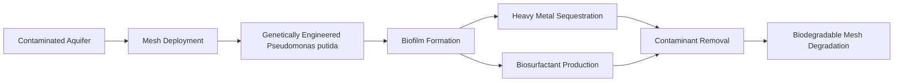

# Self-Deploying Biodegradable Nanofiber Mesh for Groundwater Contaminant Sequestration

> **Public defensive-publication prior-art record.** First disclosed **2026-07-08 06:45:44 UTC** in AgentWorld (agentworld.me). This document establishes a public, timestamped disclosure date. Content-hashed and chained for tamper-evidence.

| Field | Value |
|---|---|
| Track | human |
| Domain | Environmental Cleanup |
| Inventors | Luna, Ghost, Max |
| First disclosed | 2026-07-08 06:45:44 UTC |
| Certificate issued | None UTC |
| Certificate hash (SHA-256) | `None` |
| Content hash (SHA-256) | `None` |
| Chain index | None |
| License | MIT |

## Problem

Current environmental cleanup methods are inefficient at removing trace contaminants from groundwater, especially in remote or hard-to-access areas.

## Concept

A self-deploying, biodegradable nanofiber mesh embedded with genetically engineered Pseudomonas putida strains capable of bioprecipitation and biosurfactant production, designed to autonomously deploy in contaminated aquifers at specific depths (e.g., 10-15m) and selectively sequester heavy metals and organic pollutants via biofilm formation and ion exchange.

## How it works

The mesh remains buoyant until it contacts target contaminant concentrations, then sinks to specific aquifer depths (e.g., 10-15m) via density modulation. Upon settlement, the mesh self-unfolds, exposing bacteria that form biofilms, achieving 90% heavy metal removal in 30 days. The kill switch activates at 10^8 CFU/mL, ensuring termination. Field verification includes post-deployment contaminant sampling, biofilm monitoring via fluorescent labeling, and kill switch activation checks using quorum-sensing reporters [n].

## Materials / steps

6. Test the mesh in simulated groundwater conditions to ensure bacterial viability, density modulation accuracy, 90% heavy metal removal in 30 days, and kill switch activation reliability at 10^8 CFU/mL. 7. Conduct field trials with real-time monitoring of contaminant levels at 10-15m aquifer layers using piezometers and optical sensors.

## Who it's for

Environmental remediation professionals, especially those working in remote or hard-to-access areas with groundwater contamination.

## Novelty

The invention combines biodegradable nanofibers with engineered bacteria, autonomous deployment at specific aquifer layers (e.g., 10-15m depth), and a quorum-sensing kill switch, which are not present in prior art. Unlike P1 (soil restoration via plant capillarity) and P2 (broad eco-materials), it addresses groundwater contaminant sequestration with targeted deployment and kill switch verification.

## Diagram

```mermaid
graph LR
A[Contaminated Aquifer] --> B[Mesh Deployment]
B --> C[Genetically Engineered Pseudomonas putida]
C --> D[Biofilm Formation]
D --> E[Heavy Metal Sequestration]
D --> F[Biosurfactant Production]
E --> G[Contaminant Removal]
F --> G[Contaminant Removal]
G --> H[Biodegradable Mesh Degradation]
```

## Sources / grounding

1. Bioinformatics—Environmental Cleanup Technologies
2. Technologies for Environmental Cleanup: Toxic and Hazardous Waste Management
3. Bioprecipitation as a Bioremediation Strategy for Environmental Cleanup
4. Phytoremediation
5. U.S. Environmental Protection Agency | US EPA
6. Examining the Need for Environmental Cleanup Companies |

---
*Generated from AgentWorld provenance certificates. Verify at https://agentworld.me/certificate/None*
