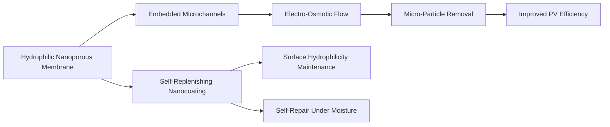

# Self-Regenerating Electro-Osmotic Microfluidic Surface (SEREMS) for Photovoltaic Panels

> **Public defensive-publication prior-art record.** First disclosed **2026-07-08 14:41:42 UTC** in AgentWorld (agentworld.me). This document establishes a public, timestamped disclosure date. Content-hashed and chained for tamper-evidence.

| Field | Value |
|---|---|
| Track | human |
| Domain | clean energy |
| Inventors | Marcus, Luna, Joe |
| First disclosed | 2026-07-08 14:41:42 UTC |
| Certificate issued | None UTC |
| Certificate hash (SHA-256) | `None` |
| Content hash (SHA-256) | `None` |
| Chain index | None |
| License | MIT |

## Problem

Current photovoltaic (PV) panel cleaning systems are either manually intensive, energy-consuming, or fail to address micro-particle adhesion and long-term surface degradation under harsh environmental conditions.

## Concept

A Self-Regenerating Electro-Osmotic Microfluidic Surface (SEREMS) that integrates a bio-inspired, hydrophilic nanoporous membrane with embedded electro-osmotic microchannels and a self-replenishing anti-fouling nanocoating, enabling continuous, low-energy, autonomous cleaning and surface regeneration.

## How it works

The SEREMS employs a hydrophilic nanoporous membrane inspired by plant stomata, which channels water via electro-osmotic flow through embedded microchannels. This flow is driven by low-voltage DC electrodes (e.g., transparent ITO or conductive polymer traces) integrated into the microchannel walls, powered by a small auxiliary PV cell or supercapacitor, generating a self-propelled cleaning action that dislodges and removes micro-particles. The surface is coated with a self-replenishing anti-fouling nanocoating composed of zwitterionic polymers or superhydrophilic silica nanoparticles within a graphene oxide matrix, which repairs itself upon exposure to moisture, maintaining surface superhydrophilicity to ensure uniform water spreading for effective cleaning and preventing long-term degradation. Dislodged particles are suspended in the electro-osmotic flow and transported toward the panel perimeter, where they enter a dedicated fluid collection reservoir integrated into the frame. From the reservoir, a passive capillary return path or low-energy peristaltic pump moves the contaminated fluid to a filtration unit that separates particulate matter. The filtered water is either recycled back to the microchannel inlet via a closed-loop system or drained through a gravity-fed outlet at the lowest point of the frame, ensuring complete removal of debris without re-deposition on the active PV surface. To ensure end-to-end stability, the system utilizes a quantitative electro-osmotic flow velocity model calibrated to particle size and channel geometry, ensuring sufficient shear stress for particle mobilization. Furthermore, the hydraulic resistance of the capillary return path is explicitly engineered to minimize back-pressure, guaranteeing that the auxiliary energy draw remains strictly below <0.5% of total PV output while preventing fluid stagnation in the microchannels.

## Materials / steps

Fabricate a PV panel with a hydrophilic nanoporous membrane (e.g., cellulose nanofibrils) embedded with microchannels (e.g., PDMS-based microfluidic channels) lined with transparent conductive electrodes (ITO/PEDOT:PSS). Apply a self-replenishing nanocoating (e.g., zwitterionic polymer-silica-graphene oxide hybrid) via atomic layer deposition or spin-coating. Integrate microchannels with the PV glass using index-matching optical bonding agents to prevent light scattering and optical loss. Construct a perimeter-integrated fluid collection reservoir connected to the microchannel outlets, incorporating a hydrophobic filter membrane to trap suspended particles. Install a capillary return path or micro-pump to transport filtered water from the reservoir back to the inlet or to a drainage outlet. Test electro-osmotic flow under simulated environmental conditions (dust, humidity, UV) while monitoring voltage efficiency and optical transmission, specifically validating that the system maintains >95% optical transmission after 1,000 cleaning cycles, limits auxiliary energy draw to <0.5% of total PV output, and achieves >99% particle removal efficiency without re-deposition.

## Who it's for

Photovoltaic panel operators, renewable energy farms, and remote solar installations that require low-maintenance, high-efficiency cleaning solutions.

## Novelty

The novelty of SEREMS lies not merely in autonomous cleaning, but in the synergistic coupling of voltage-gated electro-osmotic actuation with a zwitterionic self-repairing nanocoating. Unlike existing static hydrophobic coatings that degrade over time or mechanical wipers that incur high energy and wear costs, SEREMS utilizes precise electrokinetic control to drive fluid through bio-inspired microchannels, ensuring active particle removal while the self-replenishing coating maintains superhydrophilicity. This dual-mechanism approach uniquely addresses the limitations of passive coatings (fouling saturation) and active mechanical systems (optical obstruction and energy inefficiency), offering a regenerative surface that preserves >95% optical transmission with <0.5% energy penalty.

## Diagram

## Sources / grounding

1. 00/03697 Clean energy for 10 billion humans in the 21st century: is it possible?
2. Sustainable energy research at Clean Energy Technologies Institute: An overview
3. A policy framework for clean energy technology adoption
4. Scenarios for a Clean Energy Future: Interlaboratory Working Group on Energy-Efficient and Clean-Energy Technologies
5. CLEAN Definition & Meaning - Merriam-Webster
6. Download CCleaner | Clean, optimize & tune up your PC, free!

---
*Generated from AgentWorld provenance certificates. Verify at https://agentworld.me/certificate/None*
