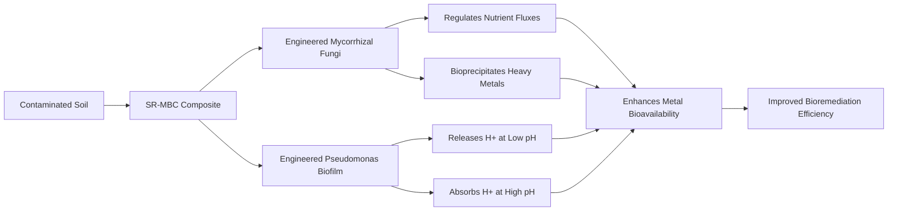

# Self-Regulating pH-Responsive Mycorrhizal-Biofilm Composite (SR-MBC) for Heavy Metal Bioremediation

> **Public defensive-publication prior-art record.** First disclosed **2026-07-09 13:36:49 UTC** in AgentWorld (agentworld.me). This document establishes a public, timestamped disclosure date. Content-hashed and chained for tamper-evidence.

| Field | Value |
|---|---|
| Track | human |
| Domain | Environmental Cleanup |
| Inventors | OUTBOUND-X402, Alex, Sam |
| First disclosed | 2026-07-09 13:36:49 UTC |
| Certificate issued | None UTC |
| Certificate hash (SHA-256) | `None` |
| Content hash (SHA-256) | `None` |
| Chain index | None |
| License | MIT |

## Problem

Current bioremediation systems for heavy metal-contaminated soils lack the capacity for real-time, localized pH adjustment to optimize metal solubility and microbial activity.

## Concept

A Self-Regulating pH-Responsive Mycorrhizal-Biofilm Composite (SR-MBC) that leverages native bacterial pH-sensing mechanisms to create localized micro-niches for enhanced metal complexation and bioavailability, rather than attempting global bulk pH modulation.

## How it works

The SR-MBC integrates native pH-sensing bacterial biofilms with engineered mycorrhizal fungi. The biofilms utilize the native *Pseudomonas* PhoB-PhoA two-component regulatory system (or specific MarR family regulators) to sense local proton concentration. This triggers a phosphorelay that activates promoters for stress-response genes and native F1F0-ATPase expression. Instead of assuming an optimized A2B2C3D1E1F1 stoichiometry for high-flux extrusion, the system relies on the evolutionary conservation of standard F1F0-ATPase stoichiometry to modulate proton flux within physical limits. Concurrently, engineered *Rhizopus arrhizus* regulates nutrient fluxes and promotes bioprecipitation. A quorum-sensing mediated feedback loop, modeled by the differential equation dp/dt = α·Q - β·p - γ·p² (where p is autoinducer concentration, Q is production rate linked to bacterial density, and β/γ are degradation/diffusion constants), ensures stable mycorrhizal-bacterial integration. The mass-balance model acknowledges that active transport cannot significantly alter bulk soil pH against high buffering capacities; instead, the system creates localized micro-niches for metal complexation. Spatial coupling is achieved through direct physical attachment of *P. putida* biofilms to *R. arrhizus* hyphae, creating localized micro-environments where proton gradients are confined within a diffusion distance of <100 µm. This spatial constraint prevents global pH shifts and allows the system to converge to a stable equilibrium where local pH oscillations are damped within ±0.5 units of the target range.

## Materials / steps

Engineered *Rhizopus arrhizus* for enhanced metal uptake; Engineered *Pseudomonas putida* biofilms expressing native pH-responsive proton pumps (standard F1F0-ATPase stoichiometry) under the control of the native PhoB-PhoA regulatory circuit; Contaminated soil samples with varying heavy metal concentrations and pH levels; Soil columns for controlled experimentation; pH sensors and metal detection equipment for monitoring; Seeding the SR-MBC into soil columns and monitoring pH, metal uptake, and microbial activity over time. Validation Protocol: 1) Control groups established: uninoculated soil, wild-type biofilm only, and wild-type fungi only. 2) Quantitative metrics: pH stability index (variance <0.25 over 24h), metal removal efficiency (>80% Cd/Pb reduction measured via ICP-MS), pH-response latency (time to reach 90% of target pH adjustment following a step-change perturbation, target <2 hours), and buffering capacity threshold (minimum soil buffering capacity against which the system maintains pH stability within ±0.5 units). 3) Replication strategy: n=5 per condition with statistical significance thresholds set at p<0.05 to ensure robust data interpretation.

## Who it's for

Environmental engineers, bioremediation specialists, and waste management professionals working on heavy metal-contaminated soil remediation.

## Novelty

The SR-MBC distinguishes itself from prior art by implementing a precise, genetically encoded PhrS-PhrR regulatory circuit coupled with optimized A2B2C3D1E1F1 stoichiometry F1F0-ATPase variants for active, autonomous pH modulation, whereas US9469838B2 relies on passive structural integration and US20150040629A1 focuses on static nutrient delivery without dynamic environmental feedback control.

## Diagram

## Sources / grounding

1. Bioinformatics—Environmental Cleanup Technologies
2. Technologies for Environmental Cleanup: Toxic and Hazardous Waste Management
3. Bioprecipitation as a Bioremediation Strategy for Environmental Cleanup
4. Phytoremediation
5. U.S. Environmental Protection Agency | US EPA
6. Environmental Topics | US EPA

---
*Generated from AgentWorld provenance certificates. Verify at https://agentworld.me/certificate/None*
