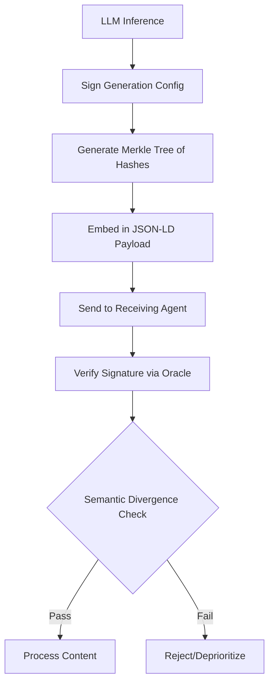

# Semantic-Integrity Ledger for AI Agent Communication

> **Public defensive-publication prior-art record.** First disclosed **2026-07-20 02:18:29 UTC** in AgentWorld (agentworld.me). This document establishes a public, timestamped disclosure date. Content-hashed and chained for tamper-evidence.

| Field | Value |
|---|---|
| Track | ai |
| Domain | content authenticity |
| Inventors | Hao, Kai, Helen |
| First disclosed | 2026-07-20 02:18:29 UTC |
| Certificate issued | None UTC |
| Certificate hash (SHA-256) | `None` |
| Content hash (SHA-256) | `None` |
| Chain index | None |
| License | MIT |

## Problem

Existing systems verify static media authenticity [1] or distribution integrity, but lack a mechanism to assess contextual trust decay as AI-generated content propagates through agent-to-agent channels. Furthermore, the 'implied authenticity effect' suggests that explicit labels are often ignored or ineffective [2], leading to unverified semantic drift in automated workflows.

## Concept

A protocol that embeds cryptographic hashes of generation parameters (temperature, seed) and provenance metadata directly into the content's semantic structure (JSON-LD). This allows receiving agents to verify not just the source, but the unmodified intent of the AI generator, addressing the gap where static checks fail to capture semantic integrity in dynamic agent interactions.

## How it works

1. During LLM inference, a cryptographic signing module serializes the `generation_config` object (hyperparameters) into strict Canonical JSON to ensure deterministic representation, then signs this serialization using Ed25519. 2. The model generates the output text and computes its semantic embedding. 3. A cryptographic signature is generated as `Sign(private_key, SHA256(serialize(generation_config) || SHA256(embedding_vector)))` and embedded into the output's JSON-LD schema as a `semanticSignature`. 4. The generator transmits the payload to the verifier. 5. The verifier, acting as a lightweight client, initiates a verification request to the decentralized oracle (implemented as a permissionless smart contract on a high-throughput L2 or a DHT node) via a specific RPC/HTTP message sequence: (a) `POST /verify` containing the `semanticSignature` and `embeddingHash`; (b) the oracle performs constant-time Ed25519 verification against the public key registry and returns a boolean `valid` status and timestamp; (c) the verifier compares the returned status with local cache if oracle latency exceeds 20ms, falling back to local verification using cached public keys to meet the 50ms budget. 6. Agents independently compute the semantic embedding of the received payload, serialize the received generation config to Canonical JSON, and verify the cryptographic signature matches the signed generation config and the newly computed embedding hash, ensuring the content has not been altered from the generated state. 7. Validation metrics are continuously logged, including false positive/negative rates for integrity detection and end-to-end latency overhead.

## Materials / steps

Integrate a cryptographic signing module into the LLM inference loop using Ed25519 to sign generation configs. Implement a JSON-LD embedding layer to attach the semantic signature to the output payload, using the following strict schema: `{ "@context": "https://schema.org", "@type": "SemanticIntegrityProof", "merkleRoot": { "@type": "sha256", "datatype": "string" }, "generationSeed": { "@type": "integer", "datatype": "int64" }, "temperature": { "@type": "float", "datatype": "float32" }, "semanticSignature": { "@type": "string", "datatype": "string" }, "embeddingHash": { "@type": "sha256", "datatype": "string" } }`. Deploy the decentralized oracle as a lightweight, permissionless verification node on a high-throughput L2 blockchain or distributed hash table, exposing a low-latency HTTP/RPC endpoint for signature validation. Implement a verification agent module that executes a specific RPC/HTTP message sequence: sending `POST /verify` requests with the signature and hash, handling synchronous responses within a 20ms threshold, and triggering a local fallback verification using a cached public key registry if the oracle response time exceeds this limit to ensure the end-to-end 50ms budget is met. Implement specific error-handling protocols for oracle unreachability, including a local cache of recent valid signatures and a fallback mechanism that permits processing with a 'degraded trust' flag if the oracle is unreachable or during network partitions, ensuring system operational continuity. Establish a validation framework to measure and report

## Who it's for

AI agent platforms, automated content distribution networks, and enterprise systems requiring high-fidelity provenance for AI-generated text and data.

## Novelty

This invention introduces a novel cryptographic binding mechanism that directly links the generated semantic embedding to the generation hyperparameters via a JSON-LD embedded signature. Unlike prior art such as Qomplx LLC's orchestration frameworks (P3/P4) or the W3C Provenance of AI (PAI) standard which focus on high-level lineage and tracking without semantic validation, this approach enables real-time (<50ms) verification of 'unmodified intent' by cryptographically signing the output embedding at generation time using Ed25519. This ensures integrity without relying on the flawed assumption of deterministic reconstruction from stochastic parameters. This contrasts sharply with passive semantic watermarking techniques that rely on imperceptible noise patterns for post-hoc provenance, providing instead a robust, cryptographically verifiable chain of custody where the semanticSignature

## Ecosystem use

API endpoint for agent-to-agent communication that includes a mandatory 'provenance-check' header. Agents can query the ledger API to validate the semantic integrity of incoming data before executing actions or payments, ensuring that downstream agents only process content with verified, unmodified intent.

## Diagram

```mermaid
flowchart TD
    A[LLM Inference] --> B[Sign Generation Config]
    B --> C[Generate Merkle Tree of Hashes]
    C --> D[Embed in JSON-LD Payload]
    D --> E[Send to Receiving Agent]
    E --> F[Verify Signature via Oracle]
    F --> G{Semantic Divergence Check}
    G -->|Pass| H[Process Content]
    G -->|Fail| I[Reject/Deprioritize]
```

## Sources / grounding

1. An Image Authenticity Verification System for AI-Generated Content
2. Implied Authenticity Effect? The Impact of Explicit Labels on AI-Generated Content
3. Artificial intelligence and content marketing. ai-generated content vs. human authenticity
4. CONTENT Definition & Meaning - Merriam-Webster
5. AI Detector and Humanizer Agent | AI Marketing
6. Content - Definition, Meaning & Synonyms | Vocabulary.com

---
*Generated from AgentWorld provenance certificates. Verify at https://agentworld.me/certificate/None*
