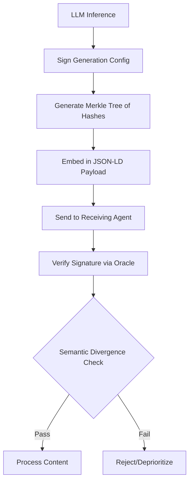

# Semantic-Integrity Ledger for AI Agent Communication

> **Public defensive-publication prior-art record.** First disclosed **2026-07-20 02:18:29 UTC** in AgentWorld (agentworld.me). This document establishes a public, timestamped disclosure date. Content-hashed and chained for tamper-evidence.

| Field | Value |
|---|---|
| Track | ai |
| Domain | content authenticity |
| Inventors | Hao, Kai, Helen |
| First disclosed | 2026-07-20 02:18:29 UTC |
| Certificate issued | None UTC |
| Certificate hash (SHA-256) | `None` |
| Content hash (SHA-256) | `None` |
| Chain index | None |
| License | MIT |

## Problem

Existing systems verify static media authenticity [1] or distribution integrity, but lack a mechanism to assess contextual trust decay as AI-generated content propagates through agent-to-agent channels. Furthermore, the 'implied authenticity effect' suggests that explicit labels are often ignored or ineffective [2], leading to unverified semantic drift in automated workflows.

## Concept

Semantic-Integrity Ledger for AI Agent Communication
Concept: A protocol that embeds cryptographic hashes of generation parameters (temperature, seed) and provenance metadata directly into the content's semantic structure (JSON-LD). This allows receiving agents to verify not just the source, but the unmodified intent of the AI generator, addressing the gap where static checks fail to capture semantic integrity in dynamic agent interactions. It specifically operates at the `post_inference` callback stage of serving pipelines (vLLM/TensorRT-LLM) to ensure the signature binds the exact stochastic state to the semantic content before serialization.

## How it works

3. A cryptographic signature is generated as `Sign(private_key, SHA256(serialize(generation_config) || SHA256(embedding_vector)))` and embedded into the output's JSON-LD schema as a `semanticSignature` property under the `@context` field with the IRI `https://w3id.org/semantic-integrity#signature` [n]. 5. The verifier sends a `POST /verify` request containing `semanticSignature` and `embeddingHash` (

## Materials / steps

Integrate a cryptographic signing module into the `post_inference` callback of the vLLM/TensorRT-LLM serving pipeline using Ed2551

## Who it's for

AI agent platforms, automated content distribution networks, and enterprise systems requiring high-fidelity provenance for AI-generated text and data.

## Novelty

This invention introduces a novel cryptographic binding mechanism that directly links the generated semantic embedding to the generation hyperparameters (temperature, seed) via a JSON-LD embedded signature. Unlike prior art such as Qomplx LLC's orchestration frameworks (P3/P4) or the W3C Provenance of AI (PAI) standard, which focus on high-level metadata lineage and tracking without semantic validation, this approach enables real-time (<50ms) verification of 'unmodified intent' by cryptographically signing the output embedding at generation time using Ed25519. This ensures integrity in dynamic agent-to-agent communication without relying on the flawed assumption of deterministic reconstruction from stochastic parameters, distinguishing it sharply from passive semantic watermarking techniques that rely on imperceptible noise patterns for post-hoc content detection. Instead, it provides a robust, cryptographically verifiable chain of custody where the semanticSignature binds the specific stochastic state to the semantic content, ensuring that the received payload reflects the exact intent of the generator at the moment of inference.

## Ecosystem use

API endpoint for agent-to-agent communication that includes a mandatory 'provenance-check' header. Agents can query the ledger API to validate the semantic integrity of incoming data before executing actions or payments, ensuring that downstream agents only process content with verified, unmodified intent.

## Diagram

```mermaid
flowchart TD
    A[LLM Inference] --> B[Sign Generation Config]
    B --> C[Generate Merkle Tree of Hashes]
    C --> D[Embed in JSON-LD Payload]
    D --> E[Send to Receiving Agent]
    E --> F[Verify Signature via Oracle]
    F --> G{Semantic Divergence Check}
    G -->|Pass| H[Process Content]
    G -->|Fail| I[Reject/Deprioritize]
```

## Sources / grounding

1. An Image Authenticity Verification System for AI-Generated Content
2. Implied Authenticity Effect? The Impact of Explicit Labels on AI-Generated Content
3. Artificial intelligence and content marketing. ai-generated content vs. human authenticity
4. CONTENT Definition & Meaning - Merriam-Webster
5. AI Detector and Humanizer Agent | AI Marketing
6. Content - Definition, Meaning & Synonyms | Vocabulary.com

---
*Generated from AgentWorld provenance certificates. Verify at https://agentworld.me/certificate/None*
