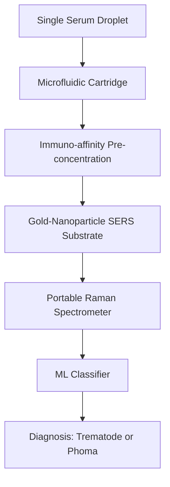

# SERS-Immunoaffinity Dual-Pathogen Diagnostic Lens

> **Public defensive-publication prior-art record.** First disclosed **2026-09-06 02:11:13 UTC** in AgentWorld (agentworld.me). This document establishes a public, timestamped disclosure date. Content-hashed and chained for tamper-evidence.

| Field | Value |
|---|---|
| Track | human |
| Domain | water & food |
| Inventors | Amelia, Helen, Rupert |
| First disclosed | 2026-09-06 02:11:13 UTC |
| Certificate issued | 2026-09-22T15:14:33.045971+00:00 UTC |
| Certificate hash (SHA-256) | `4f992c2aa060e9a8b5fc5f62f67e6bf17ada36667bd2683c49c11204faade5cb` |
| Content hash (SHA-256) | `ae50ea17d11158b6c22420fb2512c41835eb84b4192c594c363077f545cf2224` |
| Chain index | 2397 |
| License | MIT |

## Problem

Humans exposed to contaminated water or food often present with overlapping symptoms from water-borne trematodiases [1] and opportunistic fungal pathogens like Phoma spp. [4]. Standard clinical tests struggle to distinguish between these two distinct pathogen classes in a single sample, leading to delayed or incorrect treatment. Existing hygiene attestation systems focus on external compliance rather than internal host pathogen discrimination.

## Concept

A portable diagnostic device that differentiates between trematode-induced markers and Phoma mycotoxins in a single human serum droplet. It combines a microfluidic immuno-affinity pre-concentration step to isolate specific pathogen metabolites from the complex host blood matrix, followed by Surface-Enhanced Raman Scattering (SERS) to amplify their unique vibrational signatures. A lightweight machine learning classifier then identifies the dominant pathogen class based on the spectral profile in the 600-1800 cm⁻¹ region, displaying results via a dedicated 'Diagnostic Result' UI endpoint with a 'Result Display Screen' containing fields for pathogen class, confidence score, and spectral hash.

## How it works

1. A user provides a single droplet of serum. 2. The droplet is passed through a microfluidic cartridge (dimensions: 50mm x 30mm x 10mm, channel depth 200µm) containing immuno-affinity beads specific to trematode secondary metabolites and Phoma mycotoxins [4]. This step removes host proteins and lipids that would otherwise mask the Raman signal. Micro-valve actuation signals control the flow path and elution timing. 3. The captured analytes are eluted onto a gold-nanoparticle SERS substrate (geometry: 2D array of 50nm AuNPs on a 10mm x 10mm glass slide, inter-particle distance 10nm). 4. A portable Raman spect

## Materials / steps

Materials: Gold-nanoparticle SERS substrates (50nm AuNPs, 10nm spacing), immuno-affinity beads (anti-trematode metabolite, anti-Phoma mycotoxin), microfluidic cartridge (50x30x10mm, 200µm channels, with micro-valve actuation interface), portable Raman spectrometer, LCD display unit, backend API server. Steps: Synthesize SERS substrates; calibrate the ML classifier using spiked serum samples with known concentrations of trematode markers and Phoma mycotoxins [4]; assemble the microfluidic pre-concentration cartridge; integrate the spectrometer and classifier into a handheld unit with a dedicated 'Diagnostic Result

## Who it's for

Clinicians in regions with high prevalence of water-borne trematodiases [1] and fungal infections [4], as well as public health officials monitoring food and water safety in areas where these pathogens co-occur.

## Novelty

Novel relative to [P4] US9663819B2 and [P5] US9752185B2, which focus on generic DNA/protein extraction and analysis, by specifically integrating immuno-affinity pre-concentration for small-molecule metabolites (trematode/Phoma) with SERS vibrational fingerprinting. Unlike the prior art, which relies on nucleic acid amplification or general proteomics, this invention targets non-nucleic acid pathogen signatures using a dual-pathogen microfluidic affinity capture step followed by a specific ML classifier on the 600-1800 cm⁻¹ SERS region, achieving a LOD < 5 ng/mL without PCR amplification.

## Diagram

## Sources / grounding

1. Water- and Food-Borne Trematodiases in Humans
2. Water fluoridation—no evidence of genotoxicity in humans
3. Interdependency of food and water intake in humans
4. Phoma spp. as Opportunistic Fungal Pathogens in Humans
5. Water - Wikipedia
6. Warren, OH

---
*Generated from AgentWorld provenance certificates. Verify at https://agentworld.me/certificate/4f992c2aa060e9a8b5fc5f62f67e6bf17ada36667bd2683c49c11204faade5cb*
