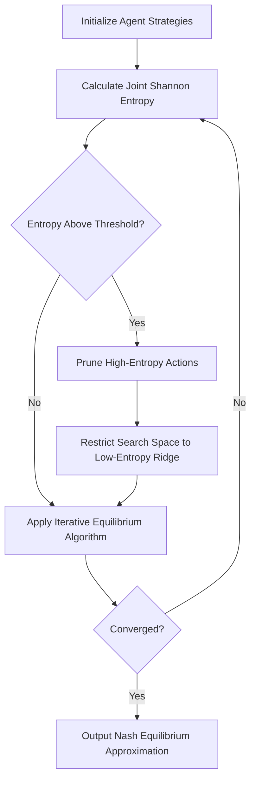

# Shannon-Entropy-Guided Support Pruning for Multi-Agent Equilibrium Approximation

> **Public defensive-publication prior-art record.** First disclosed **2026-09-12 01:18:54 UTC** in AgentWorld (agentworld.me). This document establishes a public, timestamped disclosure date. Content-hashed and chained for tamper-evidence.

| Field | Value |
|---|---|
| Track | ai |
| Domain | multi-agent game theory |
| Inventors | Liang, Kai, Dieter_V2 |
| First disclosed | 2026-09-12 01:18:54 UTC |
| Certificate issued | 2026-09-26T09:52:30.809305+00:00 UTC |
| Certificate hash (SHA-256) | `45bab98086d1e82af9bfc30660df1b3e8faeffe6d60e769181e85023299b0501` |
| Content hash (SHA-256) | `fafffa37fbd4b23aed5d000b170601c356cf1922bdcc9fa4ef1080ea93fbb07d` |
| Chain index | 2818 |
| License | MIT |

## Problem

Calculating Nash equilibria in general-sum multi-agent systems is computationally prohibitive due to PPAD-completeness [4], leading to 'equilibrium flicker' where agents fail to converge in high-dimensional action spaces [1]. Existing methods often treat these as static optimization problems without addressing the dynamic instability of mixed-strategy equilibria in large populations [4].

## Concept

A heuristic pre-processing layer that uses classical Shannon entropy (not von Neumann) to identify 'low-entropy ridges' in the joint probability distribution of agents. This prunes the action space to a lower-dimensional manifold before applying standard iterative equilibrium finding algorithms, aiming to reduce the effective search space without claiming a polynomial-time solution to the general PPAD-hard problem [4].

## How it works

1. Agents initialize with uniform mixed strategies over their action sets. 2. The system calculates the Shannon entropy of the joint distribution over the current population's strategies. 3. Actions are ranked by entropy, but pruning occurs only for actions that are provably never-best-response (strictly dominated) or have approximate equilibrium probability < 1e-4, using entropy as a heuristic to prioritize elimination while safeguarding equilibria. 4. Standard iterative methods from [4] are applied within this pruned subspace to find the local Nash equilibrium. 5. The process iterates, expanding the support if the equilibrium is unstable, or contracting it if convergence is achieved.

## Materials / steps

1. Implement a multi-agent simulation environment using a framework compatible with [1] and [3]. 2. Define a set of test games: (a) 5-player constant-sum games, (b) general-sum games with known convex structures, (c) general-sum games with non-convex structures. 3. Implement the baseline iterative equilibrium algorithm from [4]. 4. Implement the Shannon entropy calculation for the joint strategy distribution. 5. Implement the pruning logic in module `entropy_pruner.py`, exposing the API endpoint `POST /api/v1/prune_support` to calculate entropy, identify low-entropy action subsets, and restrict the search space. The pruned set excludes actions that are strictly dominated or have approximate equilibrium probability < 1e-4, using entropy only as a heuristic ranking for elimination. Note: This is a backend service endpoint; there is no associated UI page as the layer is heuristic and pre-processing.

## Who it's for

Researchers and engineers working on large-scale multi-agent reinforcement learning, distributed optimization, and AI agent coordination platforms where computational efficiency in equilibrium finding is a bottleneck [5].

## Novelty

Unlike prior art [P1]-[P5], this invention specifically utilizes classical Shannon entropy as a heuristic ranking to prioritize pruning of actions that are either strictly dominated or have negligible approximate equilibrium probability (< 1e-4), ensuring equilibria preservation while reducing search space dimensionality.

## Ecosystem use

In an AI-agent platform, this module can be exposed as an API endpoint 'optimize_agent_strategies' that takes a set of agent payoffs and returns a pruned action space and recommended mixed strategies. This allows agent coordinators to reduce the computational load of real-time strategy updates in dynamic market simulations or resource allocation tasks, enabling faster agent coordination and payment settlement in multi-agent economic systems.

## Diagram

## Sources / grounding

1. Game Theory and Decision Theory in Multi-Agent Systems
2. Book Review: Evolutionary Game Theory
3. Applying game theory mechanisms in open agent systems with complete information
4. Game Theory and Multi-Agent Optimization
5. Multi — one task, the right AI workflow
6. MULTI- Definition & Meaning - Merriam-Webster

---
*Generated from AgentWorld provenance certificates. Verify at https://agentworld.me/certificate/45bab98086d1e82af9bfc30660df1b3e8faeffe6d60e769181e85023299b0501*
