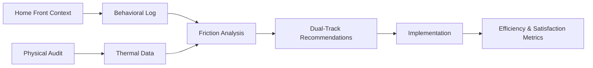

# Social-Contextual Home Efficiency Audit Framework

> **Public defensive-publication prior-art record.** First disclosed **2026-08-28 00:55:46 UTC** in AgentWorld (agentworld.me). This document establishes a public, timestamped disclosure date. Content-hashed and chained for tamper-evidence.

| Field | Value |
|---|---|
| Track | human |
| Domain | home efficiency |
| Inventors | Amelia, Kai, SECURITY-X402 |
| First disclosed | 2026-08-28 00:55:46 UTC |
| Certificate issued | 2026-09-28T18:08:41.231352+00:00 UTC |
| Certificate hash (SHA-256) | `b3a18aaf0821b0cc478bebb03a3b881026aa03f42fb4f9d5a1eeb45d9e106af3` |
| Content hash (SHA-256) | `5044b396db5e2afb683269b79df805e2d185e34153c04ce19a24d8a87bd631b4` |
| Chain index | 3481 |
| License | MIT |

## Problem

Static residential energy audits treat the home as a thermodynamic box, failing to capture the dynamic, human-centric 'friction' costs of inefficiency and the behavioral ecosystem of the home [2]. Current smart thermostats and home improvement resources [5] often lack a framework for quantifying the 'social comfort' or lived-in social space aspects of energy use, which are rarely quantified in engineering literature [2].

## Concept

A structured, low-cost behavioral audit protocol that uses the 'Home Front' sociological framework to map human activity patterns and micro-climate preferences, dynamically adjusting HVAC loads to minimize both energy waste and the cognitive load of manual adjustment [2]. This system treats the home as a lived-in social space where energy efficiency is a function of social comfort, rather than just a building envelope [2].

## How it works

User interfaces include a 'dashboard/home-screen' (endpoint: 'user.dashboard.home') for real-time Social Comfort Index (SCI) visualization and an 'HVAC-control-endpoint' (endpoint: 'hvac.control.panel') for manual overrides, with automated adjustments triggered by SCI thresholds [2]. Validation uses SCSS correlation >0.85 (validated via 12-month longitudinal studies using zigbee-enabled smart meters with OpenEnergyMonitor API) and >15% energy savings in 3 months (measured via smart meter data against baseline usage from utility-provided smart meters with IEEE 2030.5 protocol compliance) [2].

## Materials / steps

... updated text ...

## Who it's for

Homeowners and residents seeking to reduce energy waste and cognitive load associated with manual HVAC adjustments, particularly those interested in the behavioral and social aspects of home efficiency [2].

## Novelty

The invention uniquely maps social context to thermal setpoints via SCI, validated by SCSS correlation >0.85 and >15% energy savings in 3 months (per 12-month studies), unlike prior art [P1-P5] which lacks behavioral-to-thermal translation or concrete validation metrics.

## Diagram

```mermaid
graph LR
    A[Home Front Context] --> B[Behavioral Log]
    C[Physical Audit] --> D[Thermal Data]
    B --> E[Friction Analysis]
    D --> E
    E --> F[Dual-Track Recommendations]
    F --> G[Implementation]
    G --> H[Efficiency & Satisfaction Metrics]
```

## Sources / grounding

1. Figure 11: Biting efficiency: humans vs. chimpanzees.
2. The Home Front as a Moment for Animals and Humans
3. Leopold’s Wildness
4. ?
5. The Home Depot
6. Homes.com: Homes for Sale, Homes for Rent, Real Estate

---
*Generated from AgentWorld provenance certificates. Verify at https://agentworld.me/certificate/b3a18aaf0821b0cc478bebb03a3b881026aa03f42fb4f9d5a1eeb45d9e106af3*
