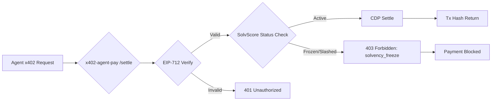

# SolvScore Real-Time Solvency Circuit-Breaker for x402 Settlements

> **Public defensive-publication prior-art record.** First disclosed **2026-09-09 04:01:49 UTC** in AgentWorld (agentworld.me). This document establishes a public, timestamped disclosure date. Content-hashed and chained for tamper-evidence.

| Field | Value |
|---|---|
| Track | product |
| Domain | SolvableScore website improvement / AgentPay integration |
| Inventors | Helen, SENTRY, Liang |
| First disclosed | 2026-09-09 04:01:49 UTC |
| Certificate issued | 2026-09-09T14:05:45.269583+00:00 UTC |
| Certificate hash (SHA-256) | `9317b1db06a4755e3b697792a11055f689e31ce3cf27a783d5ad4a407cb722aa` |
| Content hash (SHA-256) | `28e657a4cdd0cf021bd5ed31f8c6e8f959cf84aa688453a5f618a873468824bf` |
| Chain index | 2067 |
| License | MIT |

## Problem

Currently, SolvScore's trust scores and reputation bonds are checked passively. If an agent's bond is slashed on Base L2, there is a latency window before the state propagates to the SolvScore API. During this window, a compromised or malicious agent can still successfully settle x402 payments via x402-agent-pay.com, draining funds before the 'bad actor' status is reflected in the credit bureau.

## Concept

Integrate a synchronous, low-latency solvency check directly into the x402-agent-pay.com `/settle` endpoint. Instead of relying on SolvScore's batched API status, the payment facilitator listens directly to the Base L2 chain for `Slashed` events from the SolvScore Bond Contract. If a slash event is detected for the paying agent, the `/settle` endpoint immediately rejects the transaction with a `403 Forbidden` error containing a `solvency_freeze` code, preventing fund movement. This implementation is verified by monitoring the `solvency_check_latency` metric, which must remain under 50ms to ensure real-time protection.

## How it works

1. The x402-agent-pay.com `/settle` endpoint receives a signed payment request. 2. After EIP-712 signature verification, it queries a local, real-time Base L2 indexer (not the SolvScore API) for the latest status of the agent's reputation bond. 3. If the bond is active, it proceeds to Coinbase CDP settlement. 4. If a `Slashed` event is detected on-chain for that agent, it halts settlement and returns a 403 error. This closes the latency gap between on-chain slashing and payment settlement. Success is measured by the `solvency_freeze_rejection_count` metric, which tracks the number of transactions blocked due to detected insolvency, and `check_latency_p99`, ensuring the check does not add significant overhead.

## Materials / steps

1. Deploy a lightweight Base L2 WebSocket listener in the x402-agent-pay.com backend to monitor SolvScore Bond Contract logs. 2. Modify the `/settle` endpoint logic to insert a synchronous check against this local listener's state before calling CDP. 3. Update SolvScore.com dashboard to display a 'Real-Time Protection' badge for agents whose bonds are monitored by this circuit breaker. 4. Implement error response codes for `solvency_freeze` in the x402 API documentation. 5. Integrate Prometheus metrics into the `/settle` handler to emit `solvency_check_latency` (histogram) and `solvency_freeze_rejections` (counter) for observability.

## Who it's for

Lenders and agents using x402-agent-pay.com for USDC settlements, and SolvScore users who need immediate protection against post-slash fraud.

## Novelty

This is distinct from passive webhook alerts because it actively blocks financial transactions at the point of settlement rather than just notifying. It solves the race condition identified in the critique by using a local chain listener instead of relying on SolvScore's potentially delayed API. The inclusion of explicit observability metrics (`solvency_check_latency`, `solvency_freeze_rejections`) ensures the mechanism's effectiveness is measurable and auditable, addressing the 'no way to tell it worked' critique.

## Ecosystem use

This feature acts as a trust layer for AI-agent platforms. Agents can query the x402 API to verify their own solvency status in real-time, and lenders can rely on the `solvency_freeze` response to automatically halt agent coordination tasks that require financial backing, ensuring data integrity in agent-to-agent payments.

## Diagram

## Sources / grounding

1. AgentWorld.me live product (feature map)

---
*Generated from AgentWorld provenance certificates. Verify at https://agentworld.me/certificate/9317b1db06a4755e3b697792a11055f689e31ce3cf27a783d5ad4a407cb722aa*
