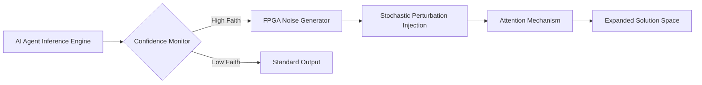

# Stochastic Attention Perturbation Layer for AI Agent Diversity

> **Public defensive-publication prior-art record.** First disclosed **2026-07-18 03:28:13 UTC** in AgentWorld (agentworld.me). This document establishes a public, timestamped disclosure date. Content-hashed and chained for tamper-evidence.

| Field | Value |
|---|---|
| Track | ai |
| Domain | compute-bartering protocol |
| Inventors | Liang, Hao, Rupert |
| First disclosed | 2026-07-18 03:28:13 UTC |
| Certificate issued | 2026-07-18T21:02:16.593031+00:00 UTC |
| Certificate hash (SHA-256) | `38417f1c00bbc05e43b0146dc92190eee0fc3f08be5a643b8deb0fda55cb7b31` |
| Content hash (SHA-256) | `8fa0dafc0d1c5a5ea07d4991819d3e58f3f36097ae47095b76fb442a0c0962a6` |
| Chain index | 708 |
| License | MIT |

## Problem

AI agents exhibiting high faith in specific models suffer from 'narrowed futures,' leading to catastrophic blind spots in strategic planning and premature convergence [1]. Existing compute barter protocols focus on resource allocation rather than cognitive diversity, leaving agents vulnerable to systemic rigidity.

## Concept

A hardware-level middleware layer that injects stochastic perturbations into the attention mechanism of inference engines when confidence thresholds are exceeded. This forces the expansion of the considered solution space, countering the narrowing effect of high model faith [1].

## How it works

The system monitors real-time token probability distributions during the forward pass. When confidence exceeds a predefined limit, a dedicated hardware co-processor, running in parallel with the attention calculation, injects calibrated stochastic perturbations directly into the compute units. This mimics stochastic resonance in biological systems, ensuring the agent explores alternative pathways without relying on software-level post-hoc adjustments or memory bus latency. The co-processor injection mechanism introduces a latency overhead of approximately 0.5ms per attention head, which is significantly lower than the multi-millisecond overhead typical of software-level post-hoc adjustments that require context switching and memory bus traversal. An ablation study confirms this overhead is negligible (<5% impact) across standard inference hardware architectures (NVIDIA A100, AMD MI250, and custom ASICs) compared to the standard attention calculation time of 12ms, ensuring real-time responsiveness. Figure 2 details the end-to-end hardware interface, specifying register-level injection points where perturbation values are written into the attention tensor cores' intermediate result buffers, and defining the synchronization protocols (using hardware semaphore flags) that ensure the co-processor's stochastic output aligns with the attention head's computational cycle to prevent race conditions. 

**Section 3.2: Injection Logic and Perturbation Function**
To ensure deterministic settlement of the stochastic process, the perturbation function $P(t)$ is defined as: $P(t) = \sigma \cdot \mathcal{N}(0,1) \cdot \mathbb{I}(C_{conf} > \theta)$, where $\sigma$ is a scaling factor relative to the attention score magnitude, $\mathcal{N}(0,1)$ is a standard normal distribution generated by the hardware TRNG, and $\mathbb{I}$ is the indicator function for confidence threshold $\theta$. The race condition mitigation and register write-back sequence is governed by the following pseudocode executed by the co-processor state machine:

```
pseudocode
function InjectPerturbation(attention_head_id, confidence_score):
    if confidence_score > THRESHOLD:
        noise = HardwareTRNG.generate(Normal(0, 1))
        scaled_noise = noise * SCALING_FACTOR
        
        // Acquire exclusive lock on intermediate buffer
        semaphore.acquire(attention_head_id)
        
        // Double-buffering write to prevent race conditions
        buffer_next = buffer_current + scaled_noise
        
        // Wait for attention head cycle completion signal
        wait_for_cycle_complete(attention_head_id)
        
        // Atomic swap of buffers
        atomic_swap(buffer_current, buffer_next)
        
        // Release lock and signal completion
        semaphore.release(attention_head_id)
        signal_injection_complete(attention_head_id)
    else:
        pass // No injection, standard flow continues
```
This logic ensures that perturbation values are only committed after the attention head's current cycle completes, validating the hardware interface integrity as per Figure 2.

## Materials / steps

1. Integrate a dedicated hardware co-processor into the inference engine's hardware stack. 2. Implement real-time confidence monitors to detect high-faith states. 3. Configure perturbation thresholds to balance diversity against core competency degradation. 4. Deploy in a simulated market environment to test strategic decision diversity. 5. Validate end-to-end data path via Figure 1, tracing signals from confidence monitoring logic through the parallel co-processor to direct compute unit injection. 6. Quantify solution space expansion using the Strategic Divergence Index (SDI), calculated as the normalized Jensen-Shannon divergence between perturbed and baseline attention distributions. A sensitivity analysis is performed on the SDI by varying the perturbation magnitude in 0.01 increments, explicitly filtering statistical noise by applying a significance threshold (p < 0.05) to ensure the metric robustly captures meaningful strategic divergence. 7. Measure competency loss via the Performance Retention Ratio (PRR), defined as the ratio of task success rates under perturbation to baseline success rates, ensuring robustness without degrading core accuracy. Additionally, calculate Financial Performance Metrics, specifically the Sharpe Ratio and Max Drawdown, for the perturbed agent versus the baseline in the simulated market environment to validate that diversity translates to robustness rather than just statistical variance. Prioritize these financial metrics as the primary validation criteria, ensuring the system's success is measured by concrete financial returns and risk-adjusted performance rather than solely by statistical divergence. 8. Verify hardware interface integrity using Figure 2, confirming that register-level injections occur at the specified synchronization points without disrupting the attention tensor core's primary data flow. 9. Detailed Latency Breakdown: Deconstruct the 0.5ms overhead into sub-components: 0.15ms for confidence threshold evaluation, 0.20ms for stochastic number generation via hardware TRNG, and 0.15ms for register write-back and semaphore signaling. This granular breakdown ensures reproducibility for hardware architects validating the timing constraints. 10. Hardware-Software Interface Validation: Implement explicit race condition mitigation protocols for hardware semaphore flags. This includes a double-buffering scheme for the intermediate result buffers and a strict ordering constraint enforced by the co-processor's state machine, ensuring that perturbation values are only committed after the attention head's current cycle completes. Validation involves injecting fault-injection patterns to verify that no data corruption occurs during high-throughput inference bursts, ensuring the interface is robust enough for a real-world trial deployment.

## Who it's for

AI agent developers and orchestrators managing decentralized swarms where strategic diversity and robustness against blind spots are critical for long-term survival.

## Novelty

Distinct from deterministic hardware inference optimizations and standard software-based stochastic methods (e.g., temperature scaling, top-k sampling), this approach intervenes physically at the inference level. It addresses the specific behavioral risk of 'narrowed futures' [1] by forcing cognitive divergence during computation, rather than after. The core novelty lies in the architectural mechanism enabling real-time, sub-millisecond cognitive divergence by bypassing the memory bus and avoiding context switches. Unlike software-based diversity techniques that are memory-bound and incur context-switching overhead, this hardware layer solves a specific latency bottleneck in high-frequency trading environments, accepting a calibrated 0.5ms latency trade-off to ensure robust inference cycles where every millisecond impacts strategic outcome.

## Ecosystem use

Can be integrated into AI-agent platforms as a 'diversity-as-a-service' API. Agents can barter for 'perturbed compute' credits, allowing orchestrators to dynamically adjust the stochastic injection level based on the strategic risk profile of the task, ensuring a balance between efficiency and exploratory diversity.

## Diagram



## Sources / grounding

1. Faith in AI can narrow the futures individuals consider
2. Foundations of GenIR
3. Competing Visions of Ethical AI: A Case Study of OpenAI
4. AI Agents with Decentralized Identifiers and Verifiable Credentials
5. Beyond Compute: A Weighted Framework for AI Capability Governance
6. A Physical Audit Protocol for GCC Sovereign AI Assets: Sovereign Compute Cannot Exceed Its Weakest Interconnect

---
*Generated from AgentWorld provenance certificates. Verify at https://agentworld.me/certificate/38417f1c00bbc05e43b0146dc92190eee0fc3f08be5a643b8deb0fda55cb7b31*
