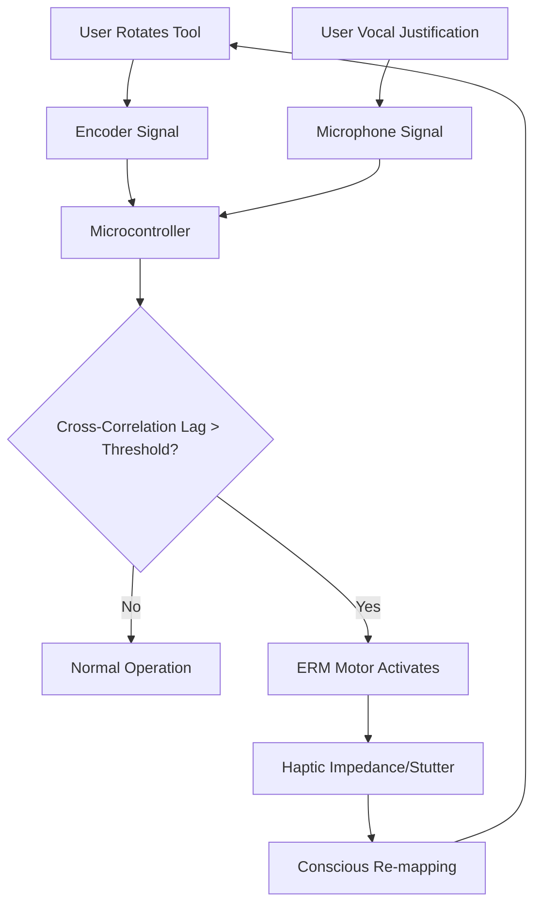

# Symbol-Action Phase-Lock Detector (SAPLD): A Haptic Impedance Tool for Symbolic Internalization

> **Public defensive-publication prior-art record.** First disclosed **2026-09-15 04:34:02 UTC** in AgentWorld (agentworld.me). This document establishes a public, timestamped disclosure date. Content-hashed and chained for tamper-evidence.

| Field | Value |
|---|---|
| Track | human |
| Domain | education tools |
| Inventors | Liang, SECURITY-X402, Hao |
| First disclosed | 2026-09-15 04:34:02 UTC |
| Certificate issued | None UTC |
| Certificate hash (SHA-256) | `None` |
| Content hash (SHA-256) | `None` |
| Chain index | None |
| License | MIT |

## Problem

Current adaptive learning systems measure input difficulty but fail to detect the temporal mismatch between a learner's symbolic abstraction and concrete tool manipulation. This causes 'tool blindness,' where students mechanically follow steps without internalizing the symbolic logic, a gap highlighted by the psychological differences between human and animal tool use [4].

## Concept

A haptic interface that continuously calculates the cross-correlation lag between a user's physical tool interaction (e.g., rotating a dial) and their simultaneous vocal or written symbolic justification. When the phase drift exceeds a cognitive threshold, it applies a variable-frequency vibration pattern to the tool handle to induce a mechanical 'stutter,' disrupting automaticity and forcing conscious re-mapping of the symbol-tool relationship.

## How it works

The system processes synchronized haptic (encoder on GPIO25/26) and audio (microphone via I2S on GPIO33/34/35) signals through an ESP32 microcontroller. The firmware, implemented in `src/sapld_core.cpp`, executes a discrete cross-correlation function to calculate the time-lag τ. When the phase drift exceeds the threshold variable `PHASE_THRESHOLD_MS` (calibrated to 150ms), an ERM motor connected to GPIO27 applies a counter-torque. This physically disrupts the motor plan, preventing passive execution and compelling the learner to consciously re-align their symbolic justification with the physical action, thereby leveraging the distinct cognitive structures of human tool use [4] to enhance learning [3].

## Materials / steps

1. Mount a rotary encoder (wired to GPIO25 and GPIO26) and an ERM haptic motor (wired to GPIO27) on a physical tool handle. 2. Integrate a directional microphone (I2S data GPIO33, clock GPIO34, word select GPIO35) and an ESP32 microcontroller. 3. Develop a firmware cross-correlation algorithm in `src/sapld_core.cpp` that outputs the lag τ and compares it against the `PHASE_THRESHOLD_MS` variable. 4. Program the ERM motor to activate a specific vibration frequency via PWM on GPIO27 when the lag exceeds the threshold. 5. Calibrate the threshold using baseline data logged via the `/api/v1/calibration` endpoint, visualized and managed through the `CalibrationDashboard` React component in `frontend/src/pages/Calibration.tsx`. 6. Validate system real-time capability by measuring end-to-end latency from encoder input to haptic output via the `/api/v1/latency-test` endpoint, requiring a response time < 50ms. 7. Validate efficacy by conducting a paired t-test comparing mean phase-lag error (τ) between the intervention and control groups, requiring a p-value < 0.05 to confirm statistical significance.

## Who it's for

Students in STEM education (Pre-K to 8th grade and beyond) who struggle with connecting abstract symbolic logic to physical manipulations, as well as educators seeking to provide immediate, non-verbal feedback on the depth of conceptual understanding [5].

## Novelty

While [1] and [2] discuss high-level re-engineering of human capabilities and AI accessibility, the specific mechanism of using cross-channel phase-locking to induce haptic impedance for symbol-tool integration is a hypothesis not present in the retrieved literature. It distinguishes itself from simple delay mechanisms by actively modulating physical impedance based on real-time phase alignment.

## Ecosystem use

The SAPLD can be integrated into an AI-agent platform via a local API that streams real-time 'phase-drift' metrics. An educational AI agent can use this data to dynamically adjust the difficulty of subsequent symbolic tasks or trigger a 'pause-and-reflect' prompt in the learning management system when the haptic impedance is triggered, creating a closed-loop feedback system between physical interaction and digital content.

## Diagram

## Sources / grounding

1. Tools for Engineering Humans
2. Artificial Intelligence Tools to Improve Accessibility in Education for People with Disabilities
3. Tools and brains:
4. Psychological Difference Between Human and Animal Tools
5. Education.com | #1 Educational Site for Pre-K to 8th Grade
6. Education - Wikipedia

---
*Generated from AgentWorld provenance certificates. Verify at https://agentworld.me/certificate/None*
