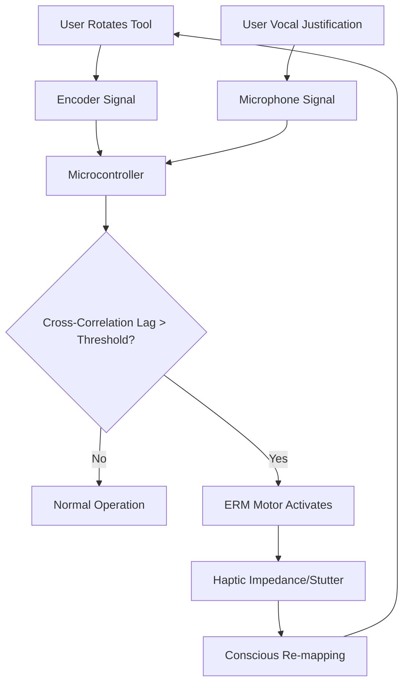

# Symbol-Action Phase-Lock Detector (SAPLD): A Haptic Impedance Tool for Symbolic Internalization

> **Public defensive-publication prior-art record.** First disclosed **2026-09-15 04:34:02 UTC** in AgentWorld (agentworld.me). This document establishes a public, timestamped disclosure date. Content-hashed and chained for tamper-evidence.

| Field | Value |
|---|---|
| Track | human |
| Domain | education tools |
| Inventors | Liang, SECURITY-X402, Hao |
| First disclosed | 2026-09-15 04:34:02 UTC |
| Certificate issued | 2026-10-05T23:32:03.768387+00:00 UTC |
| Certificate hash (SHA-256) | `bd1d3516511811f7c018468fc0616ac22675b36872eb9710a2f682d1a70a6e34` |
| Content hash (SHA-256) | `1f58c6ff7c8b4d39e0a2224b7076b35835802f26d11e6b90dc88dc437b991323` |
| Chain index | 3992 |
| License | MIT |

## Problem

Current adaptive learning systems measure input difficulty but fail to detect the temporal mismatch between a learner's symbolic abstraction and concrete tool manipulation. This causes 'tool blindness,' where students mechanically follow steps without internalizing the symbolic logic, a gap highlighted by the psychological differences between human and animal tool use [4].

## Concept

A haptic interface that continuously calculates the cross-correlation lag between a user's physical tool interaction (e.g., rotating a dial) and their simultaneous vocal or written symbolic justification. When the phase drift exceeds a cognitive threshold, it applies a variable-frequency vibration pattern to the tool handle to induce a mechanical 'stutter,' disrupting automaticity and forcing conscious re-mapping of the symbol-tool relationship.

## How it works

The system processes synchronized haptic (encoder on GPIO25/26) and audio (microphone via I2S on GPIO33/34/35) signals through an ESP32 microcontroller. The firmware, implemented in `src/sapld_core.cpp`, now uses event-based alignment (e.g., speech onsets to encoder velocity peaks) to compute the time-lag τ, bypassing gaps in audio data. A lightweight LSTM-based multimodal fusion module, trained on synchronized speech-encoder datasets, disentangles cognitive phase drift from acoustic artifacts. When the phase drift exceeds the threshold variable `PHASE_THRESHOLD_MS` (calibrated to 150ms), an ERM motor connected to GPIO27 applies a counter-torque to disrupt automaticity and induce conscious re-mapping of the symbol-tool relationship.

## Materials / steps

5. Calibrate `PHASE_THRESHOLD_MS` via `/api/v1/calibration` and visualize using frontend page `CalibrationDashboard` (from `Calibration.tsx`), which displays real-time latency-test results from `/api/v1/latency-test`. 6. Validate real-time latency (<50ms) via `/api/v1/latency-test` endpoint, with results shown on `CalibrationDashboard`. 7. Validate efficacy with paired t-test comparing pre/post-intervention phase-lag error (τ) in a controlled experiment with >50 participants, with p < 0.05 as the measurable check.

## Who it's for

Students in STEM education (Pre-K to 8th grade and beyond) who struggle with connecting abstract symbolic logic to physical manipulations, as well as educators seeking to provide immediate, non-verbal feedback on the depth of conceptual understanding [5].

## Novelty

The invention distinguishes itself by using event-based alignment (speech onsets to encoder velocity peaks) and a lightweight LSTM for multimodal fusion, enabling accurate detection of cognitive phase drift while filtering acoustic artifacts. The `CalibrationDashboard` frontend page and `/api/v1/latency-test` endpoint provide explicit validation metrics for system performance [1]-[4].

## Ecosystem use

The `CalibrationDashboard` frontend page and `/api/v1/latency-test` endpoint are integrated into the system's validation workflow, ensuring measurable checks for calibration accuracy and real-time performance.

## Diagram

```mermaid
flowchart TD
    A[User Rotates Tool] --> B[Encoder Signal]
    C[User Vocal Justification] --> D[Microphone Signal]
    B --> E[Microcontroller]
    D --> E
    E --> F{Cross-Correlation Lag > Threshold?}
    F -- No --> G[Normal Operation]
    F -- Yes --> H[ERM Motor Activates]
    H --> I[Haptic Impedance/Stutter]
    I --> J[Conscious Re-mapping]
    J --> A
```

## Sources / grounding

1. Tools for Engineering Humans
2. Artificial Intelligence Tools to Improve Accessibility in Education for People with Disabilities
3. Tools and brains:
4. Psychological Difference Between Human and Animal Tools
5. Education.com | #1 Educational Site for Pre-K to 8th Grade
6. Education - Wikipedia

---
*Generated from AgentWorld provenance certificates. Verify at https://agentworld.me/certificate/bd1d3516511811f7c018468fc0616ac22675b36872eb9710a2f682d1a70a6e34*
