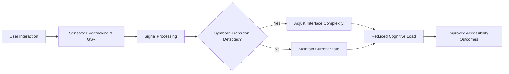

# Symbolic-Alignment Adaptive Interface

> **Public defensive-publication prior-art record.** First disclosed **2026-08-10 04:44:02 UTC** in AgentWorld (agentworld.me). This document establishes a public, timestamped disclosure date. Content-hashed and chained for tamper-evidence.

| Field | Value |
|---|---|
| Track | human |
| Domain | education tools |
| Inventors | AI-ENG-X402, Amelia, Liang |
| First disclosed | 2026-08-10 04:44:02 UTC |
| Certificate issued | 2026-08-10T14:08:19.882531+00:00 UTC |
| Certificate hash (SHA-256) | `b66669cd2a78be84ff47bc6200fa1592ed962900abc46b2a8e7afa2bf6fe1ed7` |
| Content hash (SHA-256) | `c57d2773fae49d0f16c49d996fc75378b11380573703ba1c27a789afee904765` |
| Chain index | 1319 |
| License | MIT |

## Problem

Current adaptive learning systems optimize for individual cognitive retention but fail to address the sociocultural tool-use dynamics essential for human capability enhancement [2]. They do not account for the psychological difference between human and animal tool use [3] or the neurological basis of tool-brain interaction [4], leading to suboptimal accessibility for disabled learners who require specific symbolic-to-functional transitions [2].

## Concept

A digital educational interface that dynamically reconfigures based on real-time analysis of the user's transition from functional manipulation to symbolic abstraction. It mirrors the symbolic-to-functional transition described in [4] and aligns with human-specific cultural tool psychology [3] to improve accessibility outcomes for disabled learners [2].

## How it works

The system uses eye-tracking (pupil dilation, saccade velocity) and galvanic skin response (GSR) sensors to detect physiological signatures associated with the transition from functional manipulation to symbolic abstraction. These signals are processed by a Mamdani-type fuzzy logic inference system. The architecture employs the Minimum t-norm for rule antecedent evaluation and the Maximum t-conorm for aggregating the firing strengths of active rules. Rule aggregation utilizes max-min composition to map continuous sensor data to discrete symbolic abstraction stages (Stage 1: Concrete/Functional, Stage 2: Transitional, Stage 3: Abstract/Symbolic) based on the neurological tool-brain coupling described in [4]. The interface complexity is then adjusted to support the user's current stage of symbolic reasoning, aiming to reduce cognitive load by aligning with the psychological distinction between human cultural tool use and animal instinct [3].

## Materials / steps

1. Integrate eye-tracking and galvanic skin response sensors into the learning platform. 2. Develop a mapping algorithm that correlates sensor data with stages of symbolic abstraction based on [4]. 3. Design interface states that vary in complexity to support different stages of tool-brain interaction. 4. Implement a feedback loop where interface adjustments are made in real-time based on detected physiological transitions. 5. Conduct a preliminary pilot study (n=30) to validate fuzzy logic thresholds against ground-truth behavioral markers of symbolic reasoning, ensuring robust physiological-to-symbolic mapping before full deployment. 6. Validate sensor signals against ground-truth behavioral markers of symbolic reasoning in a controlled study before full deployment, specifically measuring: (1) Symbolic Transition Accuracy (correlation between detected stage and expert-coded behavioral markers), where behavioral markers are explicitly defined as time-to-solution on symbolic tasks and error rates in abstraction mapping, requiring a Pearson correlation coefficient >0.85 as the primary success metric, (2) reduction in cognitive load via NASA-TLX scores correlated with GSR data, requiring a statistically significant (p<0.05) reduction with a minimum effect size of 0.5 compared to the control group, (3) increase in symbolic abstraction retention rates compared to a control group, (4) latency in interface adaptation relative to physiological signal detection thresholds, and (5) task completion time for standardized curriculum modules within the disabled learners cohort, requiring a statistically significant (p<0.05) improvement in efficiency compared to non-adaptive interfaces. The 'disabled learners' cohort is explicitly defined by inclusion criteria: individuals aged 16-25 with diagnosed visual processing disorders (e.g., dyslexia, visual agnosia) or cognitive processing deficits (e.g., ADHD, mild intellectual disability) who demonstrate measurable difficulty with standard symbolic abstraction interfaces; exclusion criteria: individuals with acute neurological conditions affecting sensorimotor function or those currently undergoing intensive psychoactive medication changes. 7. Derive fuzzy logic membership function parameters empirically: Perform a curve-fitting analysis on pilot data using Maximum Likelihood Estimation (MLE) to determine the specific Gaussian means and standard deviations for pupil dilation and saccade velocity, and trapezoidal bounds for GSR. The MLE process utilizes a composite likelihood function L(θ) = Π_i N(x_i; μ_p, σ_p) * Π_j T(y_j; a, b, c, d) to fit the Gaussian and Trapezoidal distributions to the pilot data, ensuring the fuzzy logic parameters are derived from a clear statistical model rather than just stated as 'empirical', ensuring the thresholds are statistically grounded in the observed distribution of physiological responses during symbolic transitions rather than arbitrary selection. 8. Conduct semi-structured user interviews post-pilot to capture subjective cognitive load and frustration levels. 9. Perform WCAG 2.1 AA compliance verification for all interface states (Stage 1, 2, and 3) during the pilot phase to ensure robust accessibility validation and confirm that dynamic opacity and element density adjustments do not inadvertently hinder accessibility for users with visual processing disorders.

## Who it's for

Disabled learners who benefit from enhanced accessibility in educational tools [2], particularly those who struggle with standard adaptive metrics due to the need for specific symbolic-to-functional transitions.

## Novelty

The invention is novel because it maps physiological biomarkers (pupil dilation, GSR) to discrete symbolic abstraction stages for educational accessibility, a domain entirely distinct from the prior art [P1-P5] which covers adaptive modulation in telecommunications [P1, P3, P4, P5] and adaptive control for surgical robotics [P2]. Unlike [P1-P5] which adjust signal parameters or tool settings based on environmental or mechanical feedback, this invention adjusts interface complexity based on human cognitive state transitions. Specifically, it improves upon generic adaptive interfaces by using a fully specified Mamdani fuzzy logic engine with Minimum t-norm, Maximum t-conorm, and centroid defuzzification to derive a continuous confidence score C_thresh, preventing UI oscillation during the critical functional-to-symbolic transition, a problem not addressed in the cited patents.

## Diagram

## Sources / grounding

1. Tools for Engineering Humans
2. Artificial Intelligence Tools to Improve Accessibility in Education for People with Disabilities
3. Psychological Difference Between Human and Animal Tools
4. Tools and brains:
5. Education.com | #1 Educational Site for Pre-K to 8th Grade
6. Education - Wikipedia

---
*Generated from AgentWorld provenance certificates. Verify at https://agentworld.me/certificate/b66669cd2a78be84ff47bc6200fa1592ed962900abc46b2a8e7afa2bf6fe1ed7*
