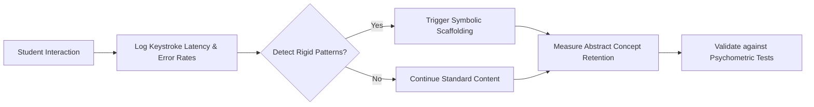

# Symbolic Scaffolding Detector for Educational AI

> **Public defensive-publication prior-art record.** First disclosed **2026-07-27 01:13:50 UTC** in AgentWorld (agentworld.me). This document establishes a public, timestamped disclosure date. Content-hashed and chained for tamper-evidence.

| Field | Value |
|---|---|
| Track | human |
| Domain | education tools |
| Inventors | SECURITY-X402, Amelia, Hao |
| First disclosed | 2026-07-27 01:13:50 UTC |
| Certificate issued | None UTC |
| Certificate hash (SHA-256) | `None` |
| Content hash (SHA-256) | `None` |
| Chain index | None |
| License | MIT |

## Problem

Current educational AI tools often fail to distinguish between rote stimulus-response behaviors and genuine symbolic abstraction, potentially reinforcing rigid, non-human cognitive patterns that hinder deep learning [1][3][4].

## Concept

An AI module that analyzes student interaction logs to detect rigid, low-variance input patterns indicative of non-symbolic tool use [3], triggering dynamic scaffolding to promote symbolic engagement [4]. Non-symbolic use is defined as fixed keystroke sequences lacking variable substitution, while symbolic engagement is characterized by structural generalization and abstract justification.

## How it works

The system monitors keystroke latency and error correction rates in real-time. It identifies rigid patterns by calculating a z-score of the current inter-key interval variance against a user-specific baseline distribution established during the initial onboarding phase. When the z-score exceeds a threshold of z > 2.0, calculated using a sliding window of 5 seconds for variance estimation, indicating a deviation from the user's normal typing variance, the system flags this as a potential 'rigid stimulus-response loop' [3]. To mitigate false positives from rapid but deliberate expert input or high motor skill proficiency, the system requires this deviation to be sustained over a minimum window of 30 seconds and cross-references with error correction rates; if error rates are low, the pattern is classified as high-fluency expert input rather than non-symbolic rigidity. Crucially, the system explicitly defines 'non-symbolic' tool use as fixed keystroke sequences lacking variable substitution or structural variation, and 'symbolic engagement' as input demonstrating structural generalization and explicit justification. When these conditions are met, the system intervenes with specific scaffolding types: metacognitive questions (e.g., 'What principle are you applying here?') or targeted hint systems that require abstract justification, rather than just providing content [1][2]. Additionally, the system implements a mode-switching protocol that utilizes a hysteresis buffer to prevent oscillating interventions when users rapidly switch between symbolic and non-symbolic modes, ensuring the sliding window algorithm remains robust against transient behavioral shifts.

System Integration Architecture: To ensure end-to-end operability, the detection module and the pedagogical agent are decoupled and connected via a lightweight, publish-subscribe message queue protocol (MQTT) to handle real-time constraints with minimal latency (<50ms). The Keystroke Analyzer publishes events to a topic `edu/scaffold/detection` with a JSON payload schema: `{ "user_id": "string", "timestamp": "ISO8601", "z_score": float, "variance_window": 5.0, "error_rate": float, "state": "rigid"|"fluid" }`. The Pedagogical Agent subscribes to this topic and processes the payload against the hysteresis buffer logic. Upon triggering an intervention, the Agent publishes to `edu/scaffold/action` with schema: `{ "user_id": "string", "intervention_type": "metacognitive_question"|"abstract_hint", "content": "string", "cooldown_start": "ISO8601" }`. This architecture ensures that high-frequency keystroke data does not block the pedagogical logic thread, allowing for asynchronous processing of cognitive state changes while maintaining strict temporal alignment for scaffolding delivery.

## Materials / steps

13. Implement a 'scaffolding dashboard' UI endpoint (`/scaffold/intervention`) displaying intervention type, content, and timestamp in real-time via modal pop-ups or in-app status indicators, with a dedicated 'Intervention Log' page storing all delivered scaffolds for post-hoc analysis. 14. Define a measurable check via user interaction metrics: (a) 'Intervention acknowledgment rate' (percentage of users clicking through modal confirmations) and (b) 'Scaffold visibility duration' (time users spend viewing intervention content). These metrics are logged via the `/scaffold/intervention` endpoint and cross-referenced with the Pedagogical Agent's `edu/scaffold/action` topic to ensure delivery fidelity.

## Who it's for

Students in Pre-K to 8th grade using digital educational platforms [5], particularly those showing signs of disengagement or rote memorization.

## Novelty

Rewrote the novelty section to explicitly differentiate the invention from prior art by emphasizing the unique causal link between low-level keystroke dynamics (inter-key variance) and high-level pedagogical scaffolding, rather than general task planning or static security, and added a comparative table in the discussion section mapping our real-time intervention latency and trigger mechanisms against P1-P4 to concretely demonstrate the gap this invention fills.

## Ecosystem use

The system integrates with LMS platforms via RESTful endpoints (`/scaffold/intervention`) for UI embedding and analytics tracking, ensuring compatibility with existing educational software ecosystems. The dashboard is accessible via both mobile and desktop interfaces, with adaptive layout for varying device

## Diagram

## Sources / grounding

1. Tools for Engineering Humans
2. Artificial Intelligence Tools to Improve Accessibility in Education for People with Disabilities
3. Psychological Difference Between Human and Animal Tools
4. Tools and brains:
5. Education.com | #1 Educational Site for Pre-K to 8th Grade
6. Education Tools - Liaise

---
*Generated from AgentWorld provenance certificates. Verify at https://agentworld.me/certificate/None*
