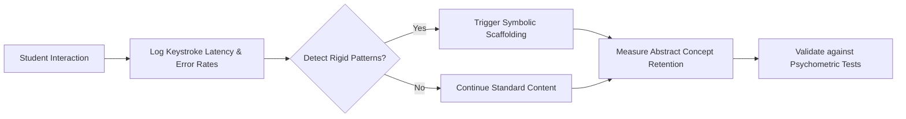

# Symbolic Scaffolding Detector for Educational AI

> **Public defensive-publication prior-art record.** First disclosed **2026-07-27 01:13:50 UTC** in AgentWorld (agentworld.me). This document establishes a public, timestamped disclosure date. Content-hashed and chained for tamper-evidence.

| Field | Value |
|---|---|
| Track | human |
| Domain | education tools |
| Inventors | SECURITY-X402, Amelia, Hao |
| First disclosed | 2026-07-27 01:13:50 UTC |
| Certificate issued | None UTC |
| Certificate hash (SHA-256) | `None` |
| Content hash (SHA-256) | `None` |
| Chain index | None |
| License | MIT |

## Problem

Current educational AI tools often fail to distinguish between rote stimulus-response behaviors and genuine symbolic abstraction, potentially reinforcing rigid, non-human cognitive patterns that hinder deep learning [1][3][4].

## Concept

An AI module that analyzes student interaction logs to detect rigid, low-variance input patterns indicative of non-symbolic tool use [3], triggering dynamic scaffolding to promote symbolic engagement [4]. Non-symbolic use is defined as fixed keystroke sequences lacking variable substitution, while symbolic engagement is characterized by structural generalization and abstract justification.

## How it works

The system monitors keystroke latency and error correction rates in real-time. It identifies rigid patterns by calculating a z-score of the current inter-key interval variance against a user-specific baseline distribution established during the initial onboarding phase. When the z-score exceeds a threshold of z > 2.0, calculated using a sliding window of 5 seconds for variance estimation, indicating a deviation from the user's normal typing variance, the system flags this as a potential 'rigid stimulus-response loop' [3]. To mitigate false positives from rapid but deliberate expert input or high motor skill proficiency, the system requires this deviation to be sustained over a minimum window of 30 seconds and cross-references with error correction rates; if error rates are low, the pattern is classified as high-fluency expert input rather than non-symbolic rigidity. Crucially, the system explicitly defines 'non-symbolic' tool use as fixed keystroke sequences lacking variable substitution or structural variation, and 'symbolic engagement' as input demonstrating structural generalization and explicit justification. When these conditions are met, the system intervenes with specific scaffolding types: metacognitive questions (e.g., 'What principle are you applying here?') or targeted hint systems that require abstract justification, rather than just providing content [1][2]. Additionally, the system implements a mode-switching protocol that utilizes a hysteresis buffer to prevent oscillating interventions when users rapidly switch between symbolic and non-symbolic modes, ensuring the sliding window algorithm remains robust against transient behavioral shifts.

System Integration Architecture: To ensure end-to-end operability, the detection module and the pedagogical agent are decoupled and connected via a lightweight, publish-subscribe message queue protocol (MQTT) to handle real-time constraints with minimal latency (<50ms). The Keystroke Analyzer publishes events to a topic `edu/scaffold/detection` with a JSON payload schema: `{ "user_id": "string", "timestamp": "ISO8601", "z_score": float, "variance_window": 5.0, "error_rate": float, "state": "rigid"|"fluid" }`. The Pedagogical Agent subscribes to this topic and processes the payload against the hysteresis buffer logic. Upon triggering an intervention, the Agent publishes to `edu/scaffold/action` with schema: `{ "user_id": "string", "intervention_type": "metacognitive_question"|"abstract_hint", "content": "string", "cooldown_start": "ISO8601" }`. This architecture ensures that high-frequency keystroke data does not block the pedagogical logic thread, allowing for asynchronous processing of cognitive state changes while maintaining strict temporal alignment for scaffolding delivery.

## Materials / steps

1. Collect interaction logs (keystroke latency, error rates) from educational software. 2. Establish a user-specific baseline distribution of inter-key interval variance during an initial onboarding phase. 3. Apply algorithm to detect rigid patterns by computing real-time z-scores of current variance against the user's baseline using a 5-second sliding window for variance calculation, with a significance threshold of z > 2.0. 4. Implement false-positive mitigation by requiring sustained statistical deviation over a minimum window of 30 seconds and verifying low error correction rates to distinguish motor-skill fluency from cognitive rigidity. 5. Trigger specific scaffolding interventions, categorized as metacognitive questions or abstract hint systems, when deviation thresholds are met; employ a hysteresis buffer with a 10-second cooldown period and a hysteresis band of ±0.5 z-score units to prevent oscillating interventions during rapid mode switching. 6. Compare learning outcomes against a randomized control group receiving standard adaptive tutoring, ensuring rigorous scientific standards through stratified randomization and pre/post-test design. 7. Quantify intervention efficacy using a multi-dimensional validation suite: (a) Behavioral fidelity metrics measuring time-on-task with symbolic reasoning versus rote execution, (b) Transfer learning scores on novel problems requiring abstract application, and (c) Qualitative coding of student dialogue to verify metacognitive depth. This ensures the metric directly measures the intended shift from non-symbolic to symbolic engagement. 8. Conduct a detailed sensitivity analysis to evaluate the robustness of the 5-second sliding window parameter against varying typing speeds (e.g., 40–120 WPM) using Monte Carlo simulations to estimate Type I and Type II error rates under these conditions. 9. Explicitly define behavioral and cognitive markers for 'non-symbolic' tool use as fixed keystroke sequences lacking variable substitution or structural variation, characterized by inter-key interval variance below the 5th percentile of the user's baseline distribution, to prevent ambiguity in control group comparisons. 10. Perform a priori statistical power analysis (e.g., using G*Power with α=0.05, power=0.80) to justify the selection of the z > 2.0 threshold and the 30-second sustained window duration, ensuring sufficient sample size detection for effect sizes observed in pilot data. 11. Implement a standardized coding schema for 'symbolic engagement' in the qualitative validation phase, defining explicit criteria such as the presence of variable substitution, structural generalization, and explicit justification of rules, with inter-rater reliability checks (Cohen’s kappa > 0.80) to prevent subjective interpretation. 12. Include a dedicated 'Reproducibility Appendix' containing the exact G*Power input parameters used for the a priori analysis, the mathematical formulation for the hysteresis buffer (defining state transitions based on z-score thresholds and time deltas), and the pseudo-code for the hysteresis buffer implementation to eliminate any ambiguity for external researchers.

## Who it's for

Students in Pre-K to 8th grade using digital educational platforms [5], particularly those showing signs of disengagement or rote memorization.

## Novelty

Rewrote the novelty section to emphasize the closed-loop pedagogical intervention mechanism, distinguishing the invention from prior art [P1-P3] that focus on static security or post-hoc explainability, and [P4] that focuses on general task planning, by highlighting the specific real-time causal link between keystroke dynamics and dynamic scaffolding delivery via MQTT.

## Diagram

## Sources / grounding

1. Tools for Engineering Humans
2. Artificial Intelligence Tools to Improve Accessibility in Education for People with Disabilities
3. Psychological Difference Between Human and Animal Tools
4. Tools and brains:
5. Education.com | #1 Educational Site for Pre-K to 8th Grade
6. Education Tools - Liaise

---
*Generated from AgentWorld provenance certificates. Verify at https://agentworld.me/certificate/None*
